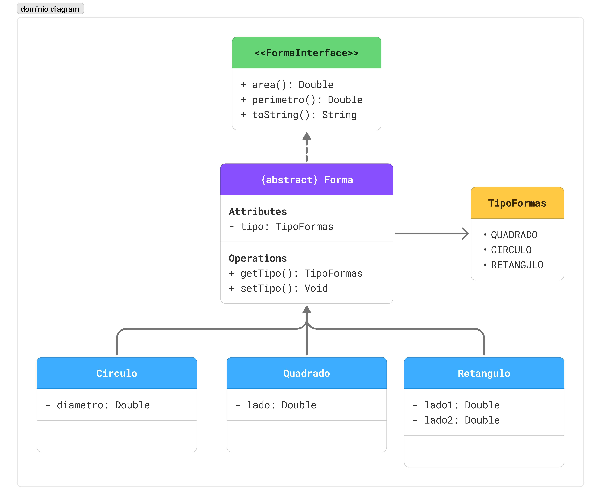

# API JWT Servico Generico (lunarJWTESG)

API em Spring Boot 4 para CRUD de formas geometricas (circulos, quadrados e retangulos) com autenticacao stateless via JWT e controle de acesso por roles.

## Sumario
- Visao geral
- Tecnologias
- Dominio
- Seguranca (JWT + roles)
- Endpoints
- Como rodar
- Configuracoes
- Exemplos rapidos
- Licenca

## Visao geral
- Servico generico: interface `FormaService` centraliza CRUD, calculo de area/perimetro e conversao DTO/entidade.
- Autenticacao JWT com `java-jwt` e filtro customizado (`SecurityFilter`) para povoar o `SecurityContext`.
- Roles: `CLI`, `FUNC`, `ADMIN` controlam quem pode criar/editar/excluir recursos.
- Documentacao em runtime pelo Springdoc: `/swagger-ui/index.html` e `/v3/api-docs`.

## Tecnologias
- Java 21
- Spring Boot 4.0.2 (Web, WebMVC, Data JPA, Security)
- JWT (com.auth0:java-jwt)
- MySQL
- Springdoc OpenAPI 3
- Maven

## Dominio
Formas compartilham a classe base `Forma` e um enum `TipoFormas`:
- `Circulo` (diametro)
- `Quadrado` (lado)
- `Retangulo` (lado1, lado2)

Diagrama de dominio (assets):


## Seguranca (JWT + roles)
- Login gera token com emissor `JWT-APP` e expiracao de 2h.
- Header: `Authorization: Bearer {token}`.
- Rotas liberadas: `POST /auth/login`, `POST /auth/user` e `GET /v3/api-docs`.
- Regras por role:
  - `ADMIN`: POST /circulos|quadrados|retangulos, DELETE /circulos|quadrados|retangulos, POST /auth/user/adm.
  - `FUNC`: PUT /circulos|quadrados|retangulos.
  - Qualquer role autenticada: GET em todos os recursos e calculos de area/perimetro.
  - Qualquer outra rota exige autenticacao.
- Para criar o primeiro ADMIN caso o banco esteja vazio, insira direto no banco ou libere temporariamente o endpoint `/auth/user/adm`.

## Endpoints
### Autenticacao
- `POST /auth/login` - body `{ "username": "...", "password": "..." }` -> `{ "token": "..." }`
- `POST /auth/user` - cria usuario com role `CLI` (publico)
- `POST /auth/user/adm` - cria usuario com role informado (requer ADMIN) - body `{ "username": "...", "password": "...", "roles": "ADMIN|FUNC|CLI" }`

### Formas (todas requerem token)
#### Padrao de payload
- Circulo: `{ "diametro": 10 }`
- Quadrado: `{ "lado": 5 }`
- Retangulo: `{ "lado1": 4, "lado2": 6 }`

#### Operacoes por recurso
- `GET /{forma}s` - lista todos
- `GET /{forma}s/{id}` - busca por id
- `POST /{forma}s` - cria (ADMIN)
- `PUT /{forma}s/{id}` - atualiza (FUNC)
- `DELETE /{forma}s/{id}` - remove (ADMIN)
- `GET /{forma}s/{id}/area` - calcula area
- `GET /{forma}s/{id}/perimetro` - calcula perimetro

Substitua `{forma}` por `circulos`, `quadrados` ou `retangulos`.

## Como rodar
Pre-requisitos: Java 21, Maven, MySQL em execucao.

1. Crie o banco `lunarJWTESG_db`.
2. Ajuste credenciais e segredo JWT em `src/main/resources/application-dev.properties`.
3. Rode a aplicacao (perfil `dev` ja esta ativo em `application.properties`):
   ```bash
   mvn spring-boot:run
   ```
   No PowerShell:
   ```powershell
   mvn spring-boot:run
   ```
4. Acesse Swagger em `http://localhost:8080/swagger-ui/index.html`.

## Configuracoes
`src/main/resources/application-dev.properties` (padrao):
```properties
spring.datasource.url=jdbc:mysql://localhost:3306/lunarJWTESG_db?useSSL=false&serverTimezone=UTC
spring.datasource.username=root
spring.datasource.password=
spring.jpa.hibernate.ddl-auto=update
spring.jpa.show-sql=true
token.secret=<defina-um-segredo>
```
- Modifique `token.secret` para um valor seguro antes de subir em producao.
- Banco e credenciais podem ser trocados conforme ambiente.

## Exemplos rapidos
### Login
```bash
curl -X POST http://localhost:8080/auth/login \
  -H "Content-Type: application/json" \
  -d '{\"username\":\"user\",\"password\":\"senha\"}'
```

### Criar circulo (ADMIN)
```bash
curl -X POST http://localhost:8080/circulos \
  -H "Content-Type: application/json" \
  -H "Authorization: Bearer <token>" \
  -d '{\"diametro\":12}'
```

### Listar quadrados (qualquer role autenticada)
```bash
curl -H "Authorization: Bearer <token>" http://localhost:8080/quadrados
```

## Licenca
MIT - veja `LICENSE`.
